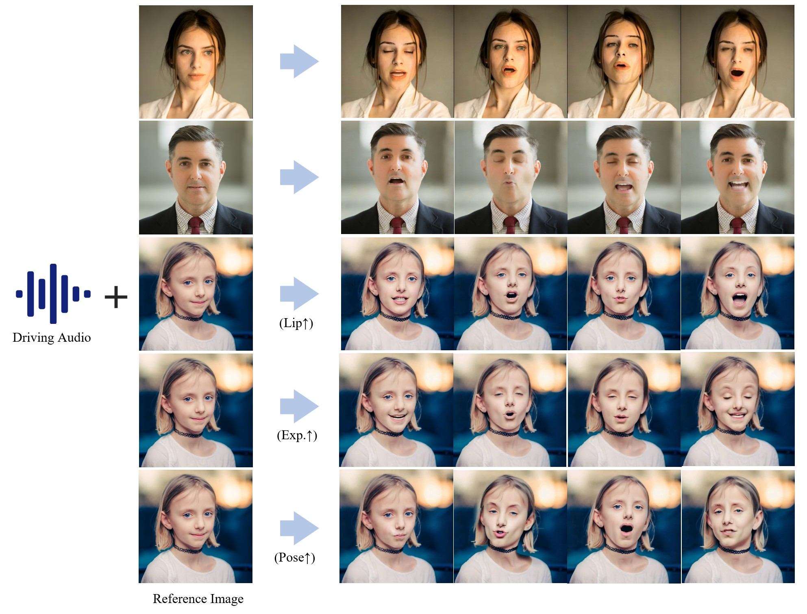
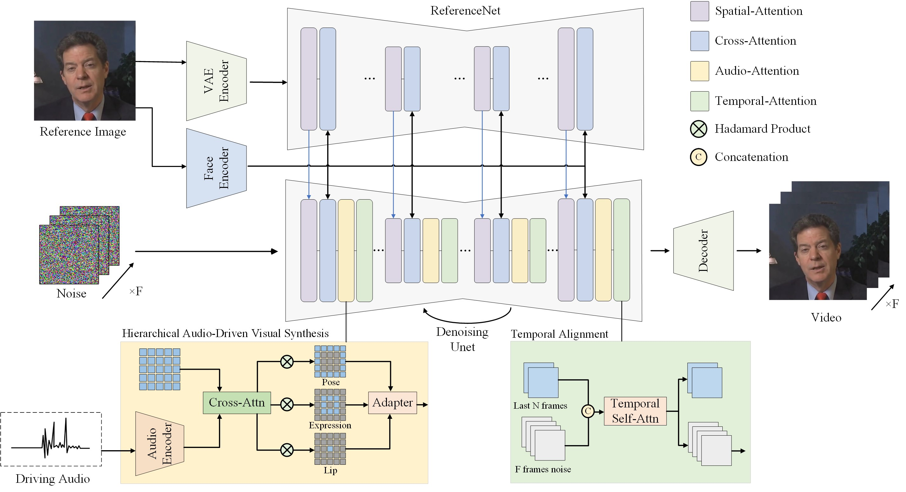

<h1 align='center'>Hallo: Hierarchical Audio-Driven Visual Synthesis for Portrait Image Animation</h1>

<h3> Venkata Satya Akash Perla - 80141877 </h3>
<h3> Srupen Dasyam - 801329678 </h3>
<h3>Yaswanth Gollapudi - 801386686 </h3>
<h3> Thadisana Navya Reddy - 801425759 </h3>

## 📸 Showcase


https://github.com/user-attachments/assets/5affa438-c304-41f8-a219-b4dcd3ae88bd


## 🔧️ Framework




## ⚙️ Installation

- System requirement: Ubuntu 20.04/Ubuntu 22.04, Cuda 12.1
- Tested GPUs: A100

Create conda environment:

```bash
  conda create -n hallo python=3.10
  conda activate hallo
```

Install packages with `pip`

```bash
  pip install -r requirements.txt
  pip install .
```

Besides, ffmpeg is also needed:
```bash
  apt-get install ffmpeg
```

## 🗝️️ Usage

The entry point for inference is `scripts/inference.py`. Before testing your cases, two preparations need to be completed:

1. [Download all required pretrained models](#download-pretrained-models).
2. [Prepare source image and driving audio pairs](#prepare-inference-data).
3. [Run inference](#run-inference).

### 📥 Download Pretrained Models

You can easily get all pretrained models required by inference from our [HuggingFace repo](https://huggingface.co/fudan-generative-ai/hallo).

Clone the pretrained models into `${PROJECT_ROOT}/pretrained_models` directory by cmd below:

```shell
git lfs install
git clone https://huggingface.co/fudan-generative-ai/hallo pretrained_models
```

Finally, these pretrained models should be organized as follows:

```text
./pretrained_models/
|-- audio_separator/
|   |-- download_checks.json
|   |-- mdx_model_data.json
|   |-- vr_model_data.json
|   `-- Kim_Vocal_2.onnx
|-- face_analysis/
|   `-- models/
|       |-- face_landmarker_v2_with_blendshapes.task  # face landmarker model from mediapipe
|       |-- 1k3d68.onnx
|       |-- 2d106det.onnx
|       |-- genderage.onnx
|       |-- glintr100.onnx
|       `-- scrfd_10g_bnkps.onnx
|-- motion_module/
|   `-- mm_sd_v15_v2.ckpt
|-- sd-vae-ft-mse/
|   |-- config.json
|   `-- diffusion_pytorch_model.safetensors
|-- stable-diffusion-v1-5/
|   `-- unet/
|       |-- config.json
|       `-- diffusion_pytorch_model.safetensors
`-- wav2vec/
    `-- wav2vec2-base-960h/
        |-- config.json
        |-- feature_extractor_config.json
        |-- model.safetensors
        |-- preprocessor_config.json
        |-- special_tokens_map.json
        |-- tokenizer_config.json
        `-- vocab.json
```

### 🛠️ Prepare Inference Data

Hallo has a few simple requirements for input data:

For the source image:

1. It should be cropped into squares.
2. The face should be the main focus, making up 50%-70% of the image.
3. The face should be facing forward, with a rotation angle of less than 30° (no side profiles).

For the driving audio:

1. It must be in WAV format.
2. It must be in English since our training datasets are only in this language.
3. Ensure the vocals are clear; background music is acceptable.

We have provided [some samples](examples/) for your reference.

### 🎮 Run Inference

Simply to run the `scripts/inference.py` and pass `source_image` and `driving_audio` as input:

```bash
python scripts/inference.py --source_image examples/reference_images/1.jpg --driving_audio examples/driving_audios/1.wav
```

Animation results will be saved as `${PROJECT_ROOT}/.cache/output.mp4` by default. You can pass `--output` to specify the output file name. You can find more examples for inference at [examples folder](https://github.com/fudan-generative-vision/hallo/tree/main/examples).

For more options:

```shell
usage: inference.py [-h] [-c CONFIG] [--source_image SOURCE_IMAGE] [--driving_audio DRIVING_AUDIO] [--output OUTPUT] [--pose_weight POSE_WEIGHT]
                    [--face_weight FACE_WEIGHT] [--lip_weight LIP_WEIGHT] [--face_expand_ratio FACE_EXPAND_RATIO]

options:
  -h, --help            show this help message and exit
  -c CONFIG, --config CONFIG
  --source_image SOURCE_IMAGE
                        source image
  --driving_audio DRIVING_AUDIO
                        driving audio
  --output OUTPUT       output video file name
  --pose_weight POSE_WEIGHT
                        weight of pose
  --face_weight FACE_WEIGHT
                        weight of face
  --lip_weight LIP_WEIGHT
                        weight of lip
  --face_expand_ratio FACE_EXPAND_RATIO
                        face region
```

## Training

### Prepare Data for Training

The training data, which utilizes some talking-face videos similar to the source images used for inference, also needs to meet the following requirements:

1. It should be cropped into squares.
2. The face should be the main focus, making up 50%-70% of the image.
3. The face should be facing forward, with a rotation angle of less than 30° (no side profiles).

Organize your raw videos into the following directory structure:


```text
dataset_name/
|-- videos/
|   |-- 0001.mp4
|   |-- 0002.mp4
|   |-- 0003.mp4
|   `-- 0004.mp4
```

You can use any `dataset_name`, but ensure the `videos` directory is named as shown above.

Next, process the videos with the following commands:

```bash
python -m scripts.data_preprocess --input_dir dataset_name/videos --step 1
python -m scripts.data_preprocess --input_dir dataset_name/videos --step 2
```

**Note:** Execute steps 1 and 2 sequentially as they perform different tasks. Step 1 converts videos into frames, extracts audio from each video, and generates the necessary masks. Step 2 generates face embeddings using InsightFace and audio embeddings using Wav2Vec, and requires a GPU. For parallel processing, use the `-p` and `-r` arguments. The `-p` argument specifies the total number of instances to launch, dividing the data into `p` parts. The `-r` argument specifies which part the current process should handle. You need to manually launch multiple instances with different values for `-r`.

Generate the metadata JSON files with the following commands:

```bash
python scripts/extract_meta_info_stage1.py -r path/to/dataset -n dataset_name
python scripts/extract_meta_info_stage2.py -r path/to/dataset -n dataset_name
```

Replace `path/to/dataset` with the path to the parent directory of `videos`, such as `dataset_name` in the example above. This will generate `dataset_name_stage1.json` and `dataset_name_stage2.json` in the `./data` directory.

### Training

Update the data meta path settings in the configuration YAML files, `configs/train/stage1.yaml` and `configs/train/stage2.yaml`:


```yaml
#stage1.yaml
data:
  meta_paths:
    - ./data/dataset_name_stage1.json

#stage2.yaml
data:
  meta_paths:
    - ./data/dataset_name_stage2.json
```

Start training with the following command:

```shell
accelerate launch -m \
  --config_file accelerate_config.yaml \
  --machine_rank 0 \
  --main_process_ip 0.0.0.0 \
  --main_process_port 20055 \
  --num_machines 1 \
  --num_processes 8 \
  scripts.train_stage1 --config ./configs/train/stage1.yaml
```

#### Accelerate Usage Explanation

The `accelerate launch` command is used to start the training process with distributed settings.

```shell
accelerate launch [arguments] {training_script} --{training_script-argument-1} --{training_script-argument-2} ...
```

**Arguments for Accelerate:**

- `-m, --module`: Interpret the launch script as a Python module.
- `--config_file`: Configuration file for Hugging Face Accelerate.
- `--machine_rank`: Rank of the current machine in a multi-node setup.
- `--main_process_ip`: IP address of the master node.
- `--main_process_port`: Port of the master node.
- `--num_machines`: Total number of nodes participating in the training.
- `--num_processes`: Total number of processes for training, matching the total number of GPUs across all machines.

**Arguments for Training:**

- `{training_script}`: The training script, such as `scripts.train_stage1` or `scripts.train_stage2`.
- `--{training_script-argument-1}`: Arguments specific to the training script. Our training scripts accept one argument, `--config`, to specify the training configuration file.

